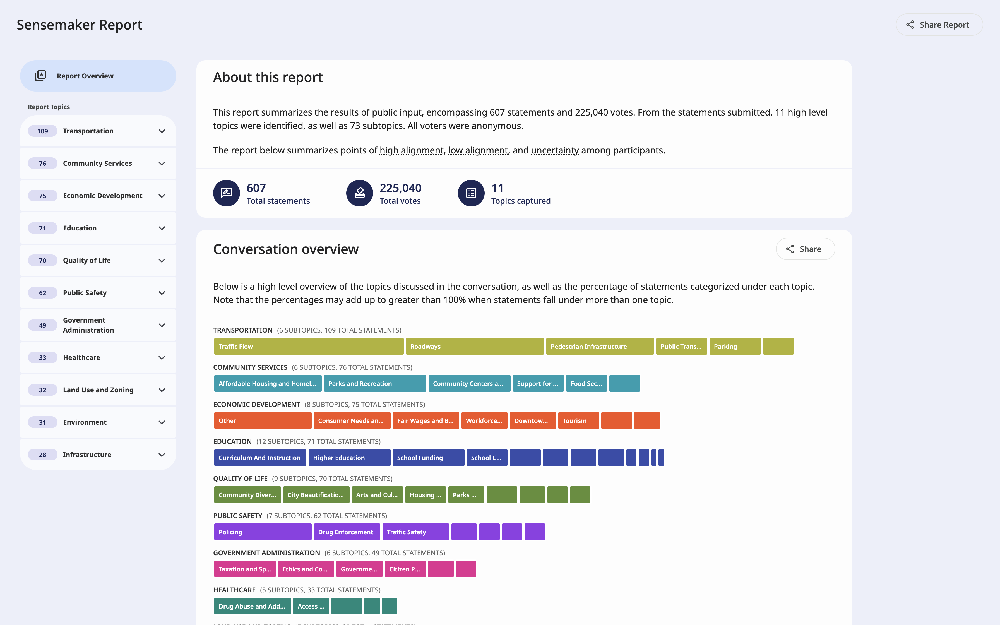

# **Sensemaker by Jigsaw \- A Google AI Proof of Concept**

This repository shares tools developed by [Jigsaw](http://jigsaw.google.com) as a proof of concept to help make sense of large-scale online conversations. It demonstrates how Large Language Models (LLMs) like Gemini can be leveraged for such tasks. This library offers a transparent look into Jigsaw's methods for categorization, summarization, and identifying agreement/disagreement in complex text. Our goal in sharing this is to inspire others and provide a potential starting point or useful elements for those tackling similar challenges.

# **About This Fork**

This fork extends the upstream Sensemaker so users can run it via **OpenRouter** or a **local LM Studio** instance — achieving low cost, high performance, and full choice of model, with user-selectable output language for reports. Two one-shot scripts turn a Polis export into a complete interactive HTML report end-to-end:

* **Local LM Studio:** [`run_local_html_report.sh`](https://github.com/bestian/sensemaking-tools/blob/new-feature-open-router-ggml/run_local_html_report.sh)
* **OpenRouter (cloud):** [`run_open_router_html_report.sh`](https://github.com/bestian/sensemaking-tools/blob/new-feature-open-router-ggml/run_open_router_html_report.sh)

For usage and parameter examples, see the comments at the top of each script.

### 繁體中文

此分支擴充了 Sensemaker，讓使用者能透過 **OpenRouter** 或地端 **LM Studio** 以低成本、高效能、自選模型的方式執行意見綜整器，並可自訂報告輸出的語言。提供兩個一鍵腳本，可從 Polis 匯出資料直接產生完整的互動式 HTML 網頁報告：

* **地端 LM Studio：** [`run_local_html_report.sh`](https://github.com/bestian/sensemaking-tools/blob/new-feature-open-router-ggml/run_local_html_report.sh)
* **OpenRouter（雲端）：** [`run_open_router_html_report.sh`](https://github.com/bestian/sensemaking-tools/blob/new-feature-open-router-ggml/run_open_router_html_report.sh)

使用方式及參數設計範例，請見各腳本開頭的註解。

### 简体中文

此分支扩展了 Sensemaker，使用户可以通过 **OpenRouter** 或本地 **LM Studio**，以低成本、高性能、自选模型的方式运行意见综整器，并可自定义报告输出的语言。提供两个一键脚本，可从 Polis 导出数据直接生成完整的交互式 HTML 网页报告：

* **本地 LM Studio：** [`run_local_html_report.sh`](https://github.com/bestian/sensemaking-tools/blob/new-feature-open-router-ggml/run_local_html_report.sh)
* **OpenRouter（云端）：** [`run_open_router_html_report.sh`](https://github.com/bestian/sensemaking-tools/blob/new-feature-open-router-ggml/run_open_router_html_report.sh)

使用方式及参数设计示例，请见各脚本开头的注释。

### Français

Ce fork étend Sensemaker pour permettre son exécution via **OpenRouter** ou une instance locale de **LM Studio** — à faible coût, avec une grande performance et un choix complet du modèle, ainsi qu'une langue de sortie configurable pour les rapports. Deux scripts en une commande transforment un export Polis en un rapport HTML interactif complet, de bout en bout :

* **LM Studio local :** [`run_local_html_report.sh`](https://github.com/bestian/sensemaking-tools/blob/new-feature-open-router-ggml/run_local_html_report.sh)
* **OpenRouter (cloud) :** [`run_open_router_html_report.sh`](https://github.com/bestian/sensemaking-tools/blob/new-feature-open-router-ggml/run_open_router_html_report.sh)

Pour des exemples d'utilisation et de paramètres, consultez les commentaires en tête de chaque script.

### Español

Este fork amplía Sensemaker para que los usuarios puedan ejecutarlo mediante **OpenRouter** o una instancia local de **LM Studio**: bajo coste, alto rendimiento y elección completa del modelo, con idioma de salida configurable para los informes. Dos scripts de un solo comando convierten una exportación de Polis en un informe HTML interactivo completo, de principio a fin:

* **LM Studio local:** [`run_local_html_report.sh`](https://github.com/bestian/sensemaking-tools/blob/new-feature-open-router-ggml/run_local_html_report.sh)
* **OpenRouter (nube):** [`run_open_router_html_report.sh`](https://github.com/bestian/sensemaking-tools/blob/new-feature-open-router-ggml/run_open_router_html_report.sh)

Para ejemplos de uso y parámetros, consulte los comentarios al inicio de cada script.

### 日本語

このフォークは Sensemaker を拡張し、**OpenRouter** またはローカルの **LM Studio** を介して、低コスト・高性能・自由なモデル選択で実行できるようにし、レポートの出力言語もユーザーが指定できるようにしました。2 本のワンショットスクリプトで、Polis のエクスポートから完全にインタラクティブな HTML レポートをエンドツーエンドで生成できます：

* **ローカル LM Studio：** [`run_local_html_report.sh`](https://github.com/bestian/sensemaking-tools/blob/new-feature-open-router-ggml/run_local_html_report.sh)
* **OpenRouter（クラウド）：** [`run_open_router_html_report.sh`](https://github.com/bestian/sensemaking-tools/blob/new-feature-open-router-ggml/run_open_router_html_report.sh)

使い方とパラメータの例については、各スクリプト冒頭のコメントをご覧ください。

### Deutsch

Dieser Fork erweitert Sensemaker so, dass er über **OpenRouter** oder eine lokale **LM Studio**-Instanz betrieben werden kann — kostengünstig, leistungsstark und mit freier Modellwahl sowie einer benutzerdefinierten Ausgabesprache für Berichte. Zwei One-Shot-Skripte erzeugen aus einem Polis-Export einen vollständigen, interaktiven HTML-Bericht von Anfang bis Ende:

* **Lokales LM Studio:** [`run_local_html_report.sh`](https://github.com/bestian/sensemaking-tools/blob/new-feature-open-router-ggml/run_local_html_report.sh)
* **OpenRouter (Cloud):** [`run_open_router_html_report.sh`](https://github.com/bestian/sensemaking-tools/blob/new-feature-open-router-ggml/run_open_router_html_report.sh)

Nutzungs- und Parameterbeispiele findest du in den Kommentaren am Anfang jedes Skripts.

# **Overview**

Effectively understanding large-scale public input is a significant challenge, as traditional methods struggle to translate thousands of diverse opinions into actionable insights. ‘Sensemaker’ showcases how Google's Gemini models can be used to transform massive volumes of raw community feedback into clear, digestible insights, aiding the analysis of these complex discussions.

The tools demonstrated here illustrate methods for:

* Topic Identification \- identifies the main points of discussion. The level of detail is configurable, allowing the tool to discover: just the top level topics; topics and subtopics; or the deepest level — topics, subtopics, and themes (sub-subtopics).  
* Statement Categorization \- sorts statements into topics defined by a user or from the Topic Identification function. Statements can belong to more than one topic.  
* Summarization \- analyzes statements and vote data to output a summary of the conversation, including an overview, themes discussed, and areas of agreement and disagreement.

These methods were applied in a [Jigsaw case study in Bowling Green, Kentucky](https://medium.com/jigsaw/how-one-of-the-fastest-growing-cities-in-kentucky-used-ai-to-plan-for-the-next-25-years-3b70c4fd1412), analyzing a major U.S. digital civic conversation.

Please see these [docs](https://jigsaw-code.github.io/sensemaking-tools/docs/) for a full breakdown of available methods and types. 

# Our Approach

The tools here show how Jigsaw is approaching the application of AI and Google’s Gemini to the emerging field of ‘sensemaking’. It is offered as an insight into our experimental methods. While parts of this library may be adaptable for other projects, developers should anticipate their own work for implementation, customization, and ongoing support for their specific use case.

# **How It Works**

## **Topic Identification**

Sensemaker provides an option to identify the topics present in the comments. The tool offers flexibility to learn:

* Top-level topics  
* Both top-level and subtopics  
* Sub-topics only, given a set of pre-specified top-level topics

Topic identification code can be found in [library/src/tasks/topic\_modeling.ts](https://github.com/Jigsaw-Code/sensemaking-tools/blob/main/library/src/tasks/topic_modeling.ts).

## **Statement Categorization**

Categorization assigns statements to one or more of the topics and subtopics. These topics can either be provided by the user, or can be the result of the "topic identification" method described above.

Topics are assigned to statements in batches, asking the model to return the appropriate categories for each statement, and leveraging the Vertex API constrained decoding feature to structure this output according to a pre-specified JSON schema, to avoid issues with output formatting. Additionally, error handling has been added to retry in case an assignment fails.

Statement categorization code can be found in [library/src/tasks/categorization.ts](https://github.com/Jigsaw-Code/sensemaking-tools/blob/main/library/src/tasks/categorization.ts).

## **Summarization**

The summarization is output as a narrative report, but users are encouraged to pick and choose which elements are right for their data (see example from the runner [here](https://github.com/Jigsaw-Code/sensemaking-tools/blob/521dd0c4c2039f0ceb7c728653a9ea495eb2c8e9/runner-cli/runner.ts#L54)) and consider showing the summarizations alongside visualizations (more tools for this coming soon).

Summarization code can be found in [library/rc/tasks/summarization.ts](https://github.com/Jigsaw-Code/sensemaking-tools/blob/main/library/src/tasks/summarization.ts).

### **Introduction Section**

Includes a short bullet list of the number of statements, votes, topics and subtopics within the summary.

### **Overview Section**

The overview section summarizes the "Themes" sections for all subtopics, along with summaries generated for each top-level topic (these summaries are generated as an intermediate step, but not shown to users, and can be thought of as intermediate “chain of thought” steps in the overall recursive summarization approach).

Currently the Overview does not reference the "Common Ground" and "Differences of Opinion" sections described below.

Percentages in the overview (e.g. “Arts and Culture (17%)”) are the percentage of statements that are about this topic. Since statements can be categorized into multiple topics these percentages add up to a number greater than 100%.

### **Top 5 Subtopics**

Sensemaker selects the top 5 subtopics by statement count, and concisely summarizes key themes found in statements within these subtopics. These themes are more concise than what appears later in the summary, to act as a quick overview.

### **Topic and Subtopic Sections**

Using the topics and subtopics from our "Topic Identification" and "Statement Categorization" features, short summaries are produced for each subtopic (or topic, if no subtopics are present).

For each subtopic, Sensemaker surfaces:

* The number of statements assigned to this subtopic.  
* Prominent themes.  
* A summary of the top statements where we find "common ground" and "differences of opinion", based on agree and disagree rates.  
* The relative level of agreement within the subtopic, as compared to the average subtopic, based on how many comments end up in “common ground” vs “differences of opinion” buckets.

#### **Themes**

For each subtopic, Sensemaker identifies up to 5 themes found across statements assigned to that subtopic, and writes a short description of each theme. This section considers all statements assigned to that subtopic.

When identifying themes, Sensemaker leverages statement text and not vote information. Sensemaker attempts to account for differing viewpoints in how it presents themes.

#### **Common Ground and Differences of Opinion**

When summarizing "Common Ground" and "Differences of Opinion" within a subtopic, Sensemaker summarizes a sample of statements selected based on statistics calculated using the agree, disagree, and pass vote counts for those statements. For each section, Sensemaker selects statements with the clearest signals for common ground and disagreement, respectively. It does not use any form of text analysis (beyond categorization) when selecting the statements, and only considers vote information.

Because small sample sizes (low vote counts) can create misleading impressions, statements with fewer than 20 votes total are not included. This avoids, for example, a total of 2 votes in favor of a particular statement being taken as evidence of broad support, and included as a point of common ground, when more voting might reveal relatively low support (or significant differences of opinion).

For this section, Sensemaker provides grounding citations to show which statements the LLM referenced, and to allow readers to check the underlying text and vote counts.

#### **Relative Agreement**

Each subtopic is labeled as “high”, “moderately high”, “moderately low” or “low” agreement. This is determined by, for each subtopic, getting *all* the comments that qualify as common ground comments and normalizing it based on how many comments were in that subtopic. Then these numbers are compared subtopic to subtopic.

### **LLMs Used and Custom Models**

This library is implemented using Google Cloud’s [VertexAI](https://cloud.google.com/vertex-ai), and works with the latest Gemini models. The access and quota requirements are controlled by a user’s Google Cloud account.

In addition to Gemini models available through VertexAI, users can integrate custom models using the library’s `Model` abstraction. This can be done by implementing a class with only two methods, one for generating plain text and one for generating structured data ([docs](https://jigsaw-code.github.io/sensemaking-tools/docs/classes/models_model.Model.html) for methods). This allows for the library to be used with models other than Gemini, with other cloud providers, and even with on-premise infrastructure for complete data sovereignty.

Please note that performance results for existing functionality may vary depending on the model selected.

### **Costs of Running**

LLM pricing is based on token count and constantly changing. Here we list the token counts for a conversation with \~1000 statements. Please see [Vertex AI pricing](https://cloud.google.com/vertex-ai/generative-ai/pricing) for an up-to-date cost per input token. As of April 10, 2025 the cost for running topic identification, statement categorization, and summarization was in total under $1 on Gemini 1.5 Pro.  
Token Counts for a 1000 statement conversation

|  | Topic Identification | Statement Categorization | Summarization |
| ----- | ----- | ----- | ----- |
| Input Tokens | 130,000 | 130,000 | 80,000 |
| Output Tokens | 50,000 | 50,000 | 7,500 |

### **Evaluations**

Our text summary consists of outputs from multiple LLM calls, each focused on summarizing a subset of comments. We have evaluated these LLM outputs for hallucinations both manually and using autoraters. Autorating code can be found in [library/evals/autorating](https://github.com/Jigsaw-Code/sensemaking-tools/tree/main/library/evals/autorating).

We have evaluated topic identification and categorization using methods based on the silhouette coefficient. This evaluation code will be published in the near future. We have also considered how stable the outputs are run to run and comments are categorized into the same topic(s) \~90% of the time, and the identified topics also show high stability.

## **Running the tools \- Setup**

First make sure you have `npm` installed (`apt-get install npm` on Ubuntu-esque systems).  
Next install the project modules by running:  
`npm install`

### **Using the Default Models \- GCloud Authentication**

A Google Cloud project is required to control quota and access when using the default models that connect to Model Garden. Installation instructions for all machines are [here](https://cloud.google.com/sdk/docs/install-sdk#deb).  
For Linux the GCloud CLI can be installed like:  
`sudo apt install -y google-cloud-cli`  
Then to log in locally run:  
`gcloud config set project <your project name here>`  
`gcloud auth application-default login`

## **Example Usage \- Javascript**

Summarize Seattle’s $15 Minimum Wage Conversation.

```javascript
// Set up the tools to use the default Vertex model (Gemini Pro 1.5) and related authentication info.
const mySensemaker = new Sensemaker({
  defaultModel: new VertexModel(
    "myGoogleCloudProject123,
    "us-central1",
  ),
});

// Note: this function does not exist.
// Get data from a discussion in Seattle over a $15 minimum wage.
// CSV containing comment text, vote counts, and group information from:
// https://github.com/compdemocracy/openData/tree/master/15-per-hour-seattle
const comments: Comments[] = getCommentsFromCsv("./comments.csv");

// Learn what topics were discussed and print them out.
const topics = mySensemaker.learnTopics(
  comments,
  // Should include subtopics:
  true,
  // There are no existing topics:
  undefined,
  // Additional context:
  "This is from a conversation on a $15 minimum wage in Seattle"
);
console.log(topics);

// Summarize the conversation and print the result as Markdown.
const summary = mySensemaker.summarize(
  comments,
  SummarizationType.AGGREGATE_VOTE,
  topics,
  // Additional context:
  "This is from a conversation on a $15 minimum wage in Seattle"
);
console.log(summary.getText("MARKDOWN"));
```

CLI Usage  
There is also a simple CLI set up for testing. There are three tools:

* [./library/runner-cli/runner.ts](https://github.com/Jigsaw-Code/sensemaking-tools/blob/main/library/runner-cli/runner.ts): takes in a CSV representing a conversation and outputs an HTML file containing the summary. The summary is best viewed as an HTML file so that the included citations can be hovered over to see the original comment and votes.  
* [./library/runner-cli/categorization\_runner.ts](https://github.com/Jigsaw-Code/sensemaking-tools/blob/main/library/runner-cli/categorization_runner.ts): takes in a CSV representing a conversation and outputs another CSV with the comments categorized into topics and subtopics.  
* [./library/runner-cli/advanced\_runner.ts](https://github.com/Jigsaw-Code/sensemaking-tools/blob/main/library/runner-cli/advanced_runner.ts): takes in a CSV representing a conversation and outputs three files for an advanced user more interested in the statistics. The first is a JSON of topics, their sizes, and their subtopics. The second is a JSON with all of the comments and their alignment scores and values. Third is the summary object as a JSON which can be used for additional processing.

**CSV Format Conversion:**

If your CSV file is exported from pol.is or polis.tw, you need to convert it to the required format before using the CLI tools.

* For CSV files from **pol.is**, use [./polis_csv_fixer/csv_converter.py](https://github.com/bestian/sensemaking-tools/blob/new-feature-open-router/polis_csv_fixer/csv_converter.py):

```bash
python polis_csv_fixer/csv_converter.py input.csv output.csv
```

* For CSV files from **polis.tw**, use [./polis_csv_fixer/csv_converter_for_polis_tw.py](https://github.com/bestian/sensemaking-tools/blob/new-feature-open-router/polis_csv_fixer/csv_converter_for_polis_tw.py):

```bash
python polis_csv_fixer/csv_converter_for_polis_tw.py input.csv [output.csv]
```

**OpenRouter CLI Tools:**

* [./library/runner-cli/runner\_openrouter.ts](https://github.com/bestian/sensemaking-tools/blob/new-feature-open-router/library/runner-cli/runner_openrouter.ts): Same usage as `runner.ts`, but uses OpenRouter models. Supports multi-language output via the `--output_lang` parameter.

```bash
npx ts-node ./library/runner-cli/runner_openrouter.ts \
  --outputBasename out \
  --inputFile "./files/comments.csv" \
  --additionalContext "Description of the conversation" \
  --output_lang zh-TW
```

The `--output_lang` parameter supports: `en` (default), `zh-TW`, `zh-CN`, `fr`, `es`, `ja`.

* [./library/runner-cli/categorization\_runner\_openrouter.ts](https://github.com/bestian/sensemaking-tools/blob/new-feature-open-router/library/runner-cli/categorization_runner_openrouter.ts): Uses OpenRouter models for topic categorization. Supports custom model selection and topic depth configuration.

```bash
npx ts-node ./library/runner-cli/categorization_runner_openrouter.ts \
  --inputFile "./files/comments.csv" \
  --outputFile "./files/categorized_comments.csv" \
  --topicDepth 2 \
  --additionalContext "Description of the conversation"
```

* [./library/runner-cli/advanced\_runner\_open\_router.ts](https://github.com/bestian/sensemaking-tools/blob/new-feature-open-router-ggml/library/runner-cli/advanced_runner_open_router.ts): OpenRouter equivalent of `advanced_runner.ts`. Categorizes and summarizes a processed Polis CSV with an OpenRouter model and writes the three JSON files (`-topic-stats.json`, `-comments-with-scores.json`, `-summary.json`) consumed by the HTML report builder.

```bash
npx ts-node ./library/runner-cli/advanced_runner_open_router.ts \
  --inputFile "./tmp/processed-comments.csv" \
  --outputBasename "./tmp/openrouter-report" \
  --additionalContext "Description of the conversation" \
  --model "openai/gpt-oss-120b" \
  --apiKey "$OPENROUTER_API_KEY" \
  --outputLang zh-TW \
  --topicDepth 2
```

* [./library/runner-cli/overview\_subtask\_open\_router.ts](https://github.com/bestian/sensemaking-tools/blob/new-feature-open-router-ggml/library/runner-cli/overview_subtask_open_router.ts): Runs **only** the overview summarization subtask against a live OpenRouter model using a synthetic fixture. Useful for isolating overview-prompt regressions without a Polis CSV.

```bash
npx ts-node ./library/runner-cli/overview_subtask_open_router.ts \
  --model "openai/gpt-oss-120b" \
  --method one-shot \
  --outputLang zh-TW
```

Set the `OPENROUTER_API_KEY` environment variable before running these tools. The model can be specified via `OPENROUTER_MODEL` environment variable, or per-invocation via `--model` / `--apiKey`.

**OpenRouter one-shot pipeline:**

[`run_open_router_html_report.sh`](https://github.com/bestian/sensemaking-tools/blob/new-feature-open-router-ggml/run_open_router_html_report.sh) is the cloud counterpart to `run_local_html_report.sh`: it downloads a Polis export, runs `advanced_runner_open_router.ts`, and bundles the result into a single shareable HTML report. The script auto-installs missing workspace dependencies and builds `visualization-library/` on first run.

```bash
bash ./run_open_router_html_report.sh \
  --export-base-url "https://bloom.civic.ai/api/v3/reportExport/<your-report-id>" \
  --open-router-api-key "sk-or-..." \
  --model "openai/gpt-oss-120b" \
  --outputLang zh-TW
```

These tools process CSV input files.  These must contain the columns `comment_text` and `comment-id`.  For deliberations without group information, vote counts should be set in columns titled `agrees`, `disagrees` and `passes`.  If you do not have vote information, these can be set to 0. For deliberations with group breakdowns, you can set the columns `{group_name}-agree-count`, `{group_name}-disagree-count`, `{group_name}-pass-count`.

## **Generating a Report \- Get a webpage presentation of the report**



To build a webpage presenting the results of the report, follow these steps:

* Generate the 3 JSON files produced by running the advanced runner CLI tool (mentioned previously).
* From the command line, access the web app directory by running `cd web-ui` from the root directory.
* Then, get the website build (in a folder) by running the following command, being sure to include the paths to each of the 3 JSON files as well as the title of the report. The build will be placed at `web-ui > dist > web-ui`.
```sh
npx ts-node site-build.ts --topics <path-to-topics-file> --summary <path-to-summary-file> --comments <path-to-comments-file> --reportTitle "Title of Report"
```
* Access the build (using `cd`) and start the web server by running `npm run dev`. Then access the site in a browser at `localhost:4200`.

Alternatively, a single HTML file for the report can be produced, which can be easily shared.
* After generating the build, run the following command (from `root > web-ui`):
```sh
npx ts-node single-html-build.js
```
The tool will output the location of the produced HTML file. Access this file in a browser to view the report.

## **Making Changes to the tools \- Development**

### **Testing**

Unit tests can be run with the following command: `npm test`  
To run tests continuously as you make changes run: `npm run test-watch`

## **Documentation**

The documentation [here](https://jigsaw-code.github.io/sensemaking-tools) is the hosted version of the html from the docs/ subdirectory. This documentation is automatically generated using typedoc, and to update the documentation run:  
`npx typedoc`

## **Contribution and Improvements**

This repository offers a transparent view of Jigsaw's approach to large-scale conversation sensemaking with AI. Developers can:

* **Review the code** to understand Jigsaw's techniques with LLMs.  
* **Leverage components** for their own projects (some customization may be needed).  
* **Use the command and prompt examples, and overall approach,** as inspiration for their own sensemaking tools.

We encourage experimentation and building upon the ideas shared here\!

## **Cloud Vertex Terms of Use**

This library is designed to leverage Vertex AI, and usage is subject to the [Cloud Vertex Terms of Service](https://cloud.google.com/terms/service-terms) and the [Generative AI Prohibited Use Policy](https://policies.google.com/terms/generative-ai/use-policy).  
